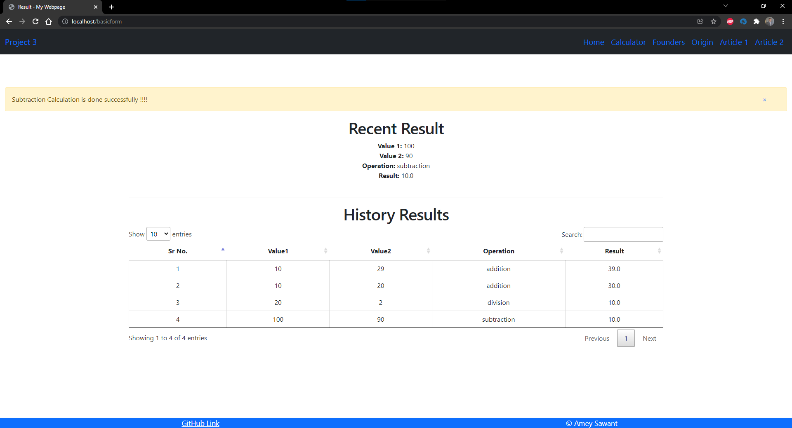
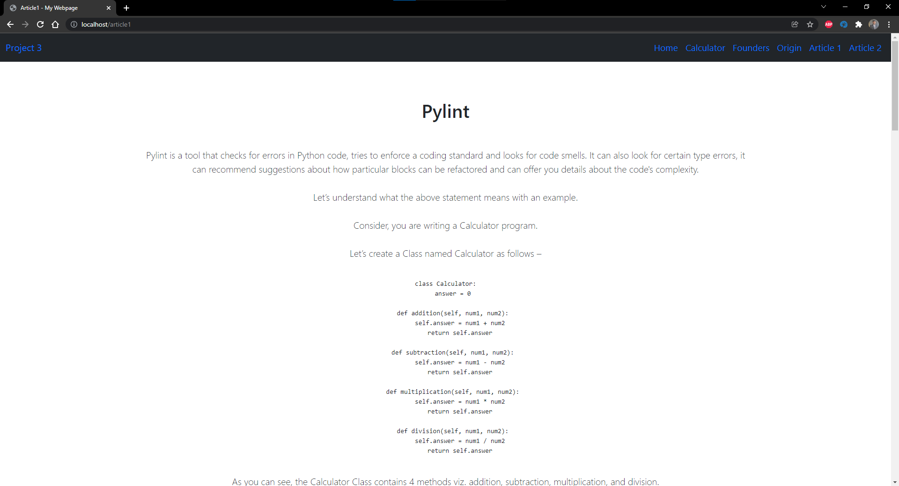

# Flash Demo

### Both input fields are empty

### Input field 1 is empty

### Input field 2 is empty

### When both input fields are filled and Addition operation

### When both input fields are filled and Subtraction operation

### When both input fields are filled and Multiplication operation

### When both input fields are filled and Division operation
